# Домашнее задание к занятию «Практическое применение Docker»» - Петр Петров
### Задание 0. 
Убедитесь что у вас НЕ(!) установлен docker-compose, для этого получите следующую ошибку от команды docker-compose --version
Command 'docker-compose' not found, but can be installed with:

sudo snap install docker          # version 24.0.5, or
sudo apt  install docker-compose  # version 1.25.0-1

See 'snap info docker' for additional versions.
В случае наличия установленного в системе docker-compose - удалите его.
2. Убедитесь что у вас УСТАНОВЛЕН docker compose(без тире) версии не менее v2.24.X, для это выполните команду docker compose version

### Решение 0.
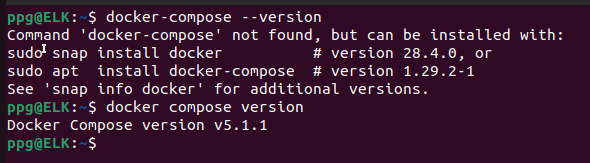

### Задание 1.
Сделайте в своем GitHub пространстве fork репозитория.

Создайте файл Dockerfile.python на основе существующего Dockerfile:

Используйте базовый образ python:3.12-slim
Обязательно используйте конструкцию COPY . . в Dockerfile
Создайте .dockerignore файл для исключения ненужных файлов
Используйте CMD ["uvicorn", "main:app", "--host", "0.0.0.0", "--port", "5000"] для запуска
Протестируйте корректность сборки 2.1 Используйте multistage сборку вместо single stage.
(Необязательная часть, *) Изучите инструкцию в проекте и запустите web-приложение без использования docker, с помощью venv. (Mysql БД можно запустить в docker run).

(Необязательная часть, *) Изучите код приложения и добавьте управление названием таблицы через ENV переменную.

### Решение 1.
Контейнер запускается. uvicorn работает. multistage есть.

### Задание 2*.

### Задание 3.
Изучите файл "proxy.yaml"
Создайте в репозитории с проектом файл compose.yaml. С помощью директивы "include" подключите к нему файл "proxy.yaml".
Опишите в файле compose.yaml следующие сервисы:
web. Образ приложения должен ИЛИ собираться при запуске compose из файла Dockerfile.python ИЛИ скачиваться из yandex cloud container registry(из задание №2 со *). Контейнер должен работать в bridge-сети с названием backend и иметь фиксированный ipv4-адрес 172.20.0.5. Сервис должен всегда перезапускаться в случае ошибок. Передайте необходимые ENV-переменные для подключения к Mysql базе данных по сетевому имени сервиса web

db. image=mysql:8. Контейнер должен работать в bridge-сети с названием backend и иметь фиксированный ipv4-адрес 172.20.0.10. Явно перезапуск сервиса в случае ошибок. Передайте необходимые ENV-переменные для создания: пароля root пользователя, создания базы данных, пользователя и пароля для web-приложения.Обязательно используйте уже существующий .env file для назначения секретных ENV-переменных!

Запустите проект локально с помощью docker compose , добейтесь его стабильной работы: команда curl -L http://127.0.0.1:8090 должна возвращать в качестве ответа время и локальный IP-адрес. Если сервисы не стартуют воспользуйтесь командами: docker ps -a  и docker logs <container_name> . Если вместо IP-адреса вы получаете информационную ошибку --убедитесь, что вы шлете запрос на порт 8090, а не 5000.

Подключитесь к БД mysql с помощью команды docker exec -ti <имя_контейнера> mysql -uroot -p<пароль root-пользователя>(обратите внимание что между ключем -u и логином root нет пробела. это важно!!! тоже самое с паролем) . Введите последовательно команды (не забываем в конце символ ; ): show databases; use <имя вашей базы данных(по-умолчанию virtd, как это указано в .env)>; show tables; SELECT * from requests LIMIT 10;. Примечание: таблица в БД создается после первого поступившего запроса к приложению.

Остановите проект. В качестве ответа приложите скриншот sql-запроса.

### Решение 3.

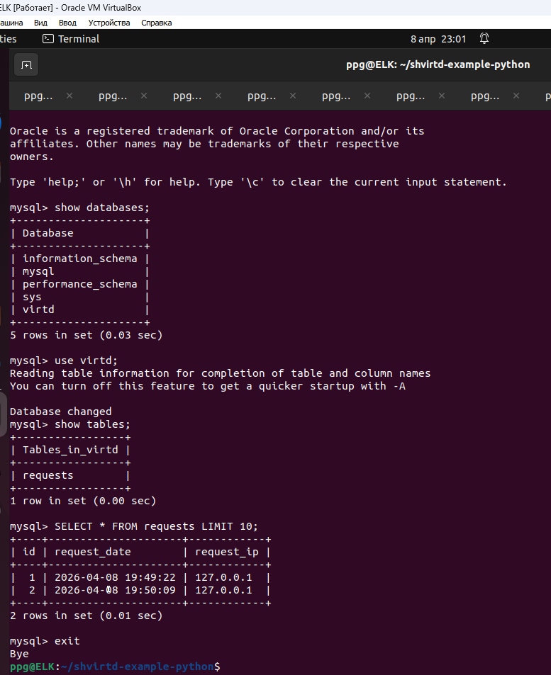

### Задание 4.

Запустите в Yandex Cloud ВМ (вам хватит 2 Гб Ram).
Подключитесь к Вм по ssh и установите docker.
Напишите bash-скрипт, который скачает ваш fork-репозиторий в каталог /opt и запустит проект целиком.
Зайдите на сайт проверки http подключений, например(или аналогичный): https://check-host.net/check-http и запустите проверку вашего сервиса http://<внешний_IP-адрес_вашей_ВМ>:8090. Таким образом трафик будет направлен в ingress-proxy. Трафик должен пройти через цепочки: Пользователь → Internet → Nginx → HAProxy → FastAPI(запись в БД) → HAProxy → Nginx → Internet → Пользователь
(Необязательная часть) Дополнительно настройте remote ssh context к вашему серверу. Отобразите список контекстов и результат удаленного выполнения docker ps -a
Повторите SQL-запрос на сервере и приложите скриншот и ссылку на fork.

### Решение 4.

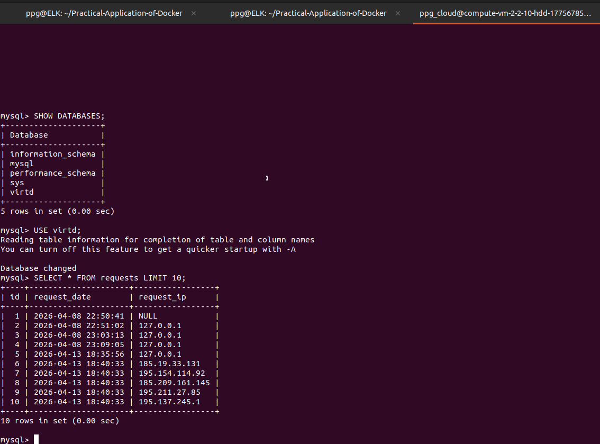

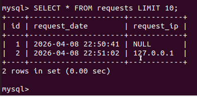

[bash-скрипт, который скачивает fork-репозиторий в каталог /opt и запускает  проект целиком](deploy.sh)

### Задание 5*.

### Задание 6.
Скачайте docker образ hashicorp/terraform:latest и скопируйте бинарный файл /bin/terraform на свою локальную машину, используя dive и docker save. Предоставьте скриншоты действий .

### Решение 6.
1. скачиваем образ  

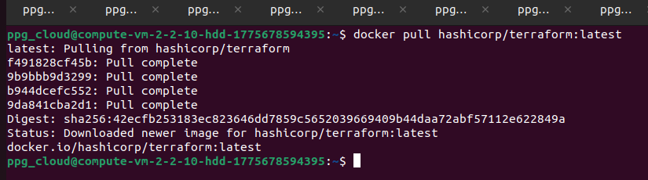

2. сохраняем образ в tar  

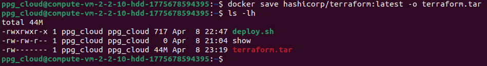

3. анализ через dive  

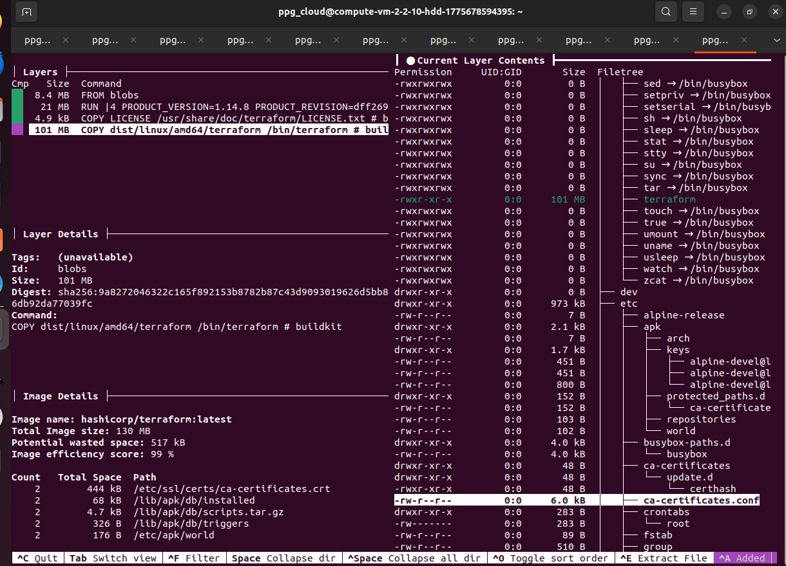

4. Распаковываем и находим слой, который мы увидели в dive  

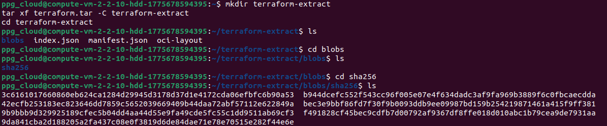

5. Распаковываем слой 

### Задание 6.1
Добейтесь аналогичного результата, используя docker cp.
Предоставьте скриншоты действий .

### Решение 6.1

1. создаем контейнер  

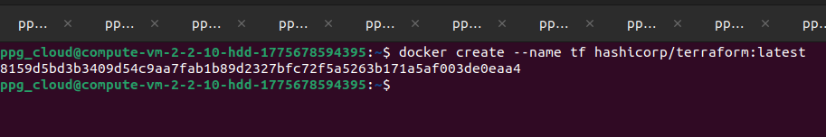

2. копируем бинарник  

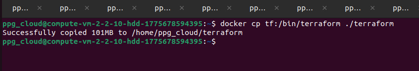

3. проверяем файл и запуск  

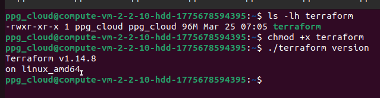

