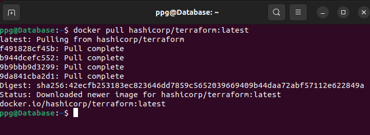
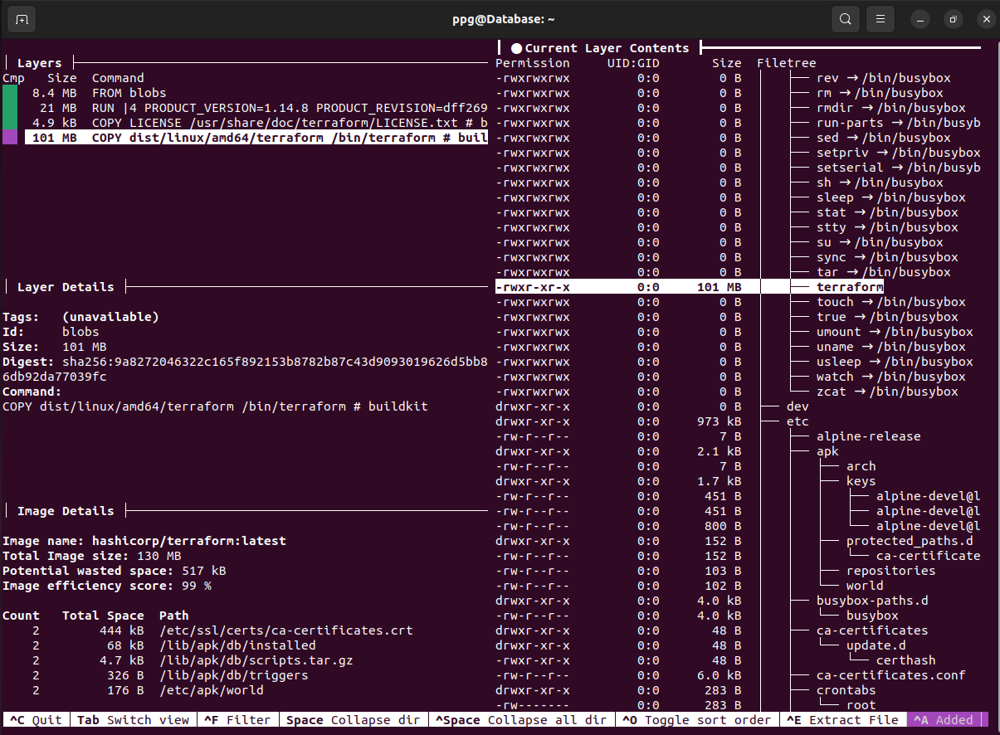
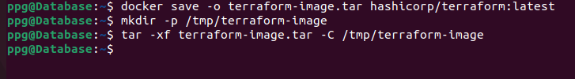
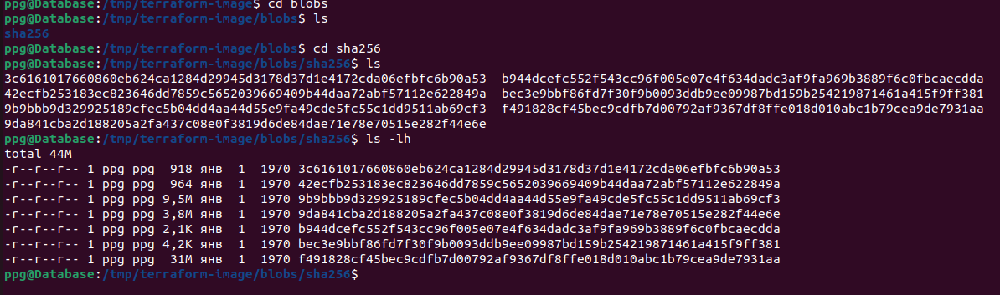
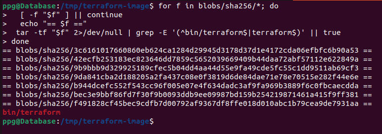
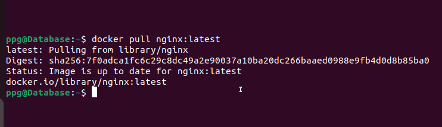
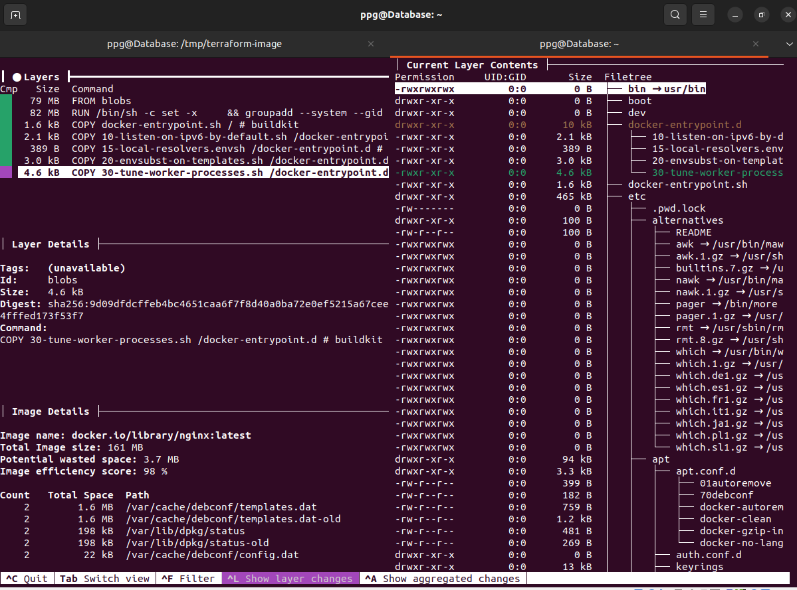
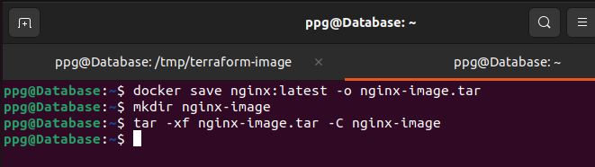
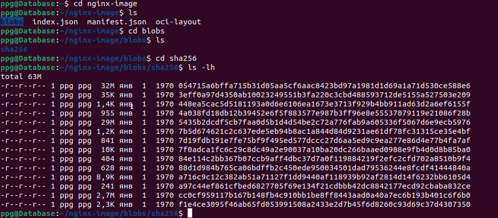

### Задание 6.
Скачайте docker образ hashicorp/terraform:latest и скопируйте бинарный файл /bin/terraform на свою локальную машину, используя dive и docker save. Предоставьте скриншоты действий .

### Решение 6.1
1. скачиваем образ terraform  

2. смотрим слои через dive и находим слой, где присутствует /bin/terraform  

3. сохраняем образ в tar и распаковываем tar во временную папку  

4. смотрим набор слоев в контейнере  

и не находим совпадение.

5. ищем в каком слое находится terraform  

### Решение 6.1(2)
1. скачиваем образ nginx  

2. смотрим слои через dive  

dive nginx:latest

3. сохраняем образ в tar и распаковываем tar во временную папку  

4. смотрим набор слоев в контейнере  

и не находим совпадение.

